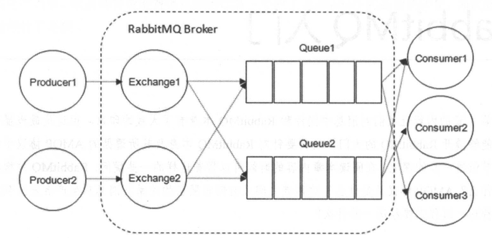
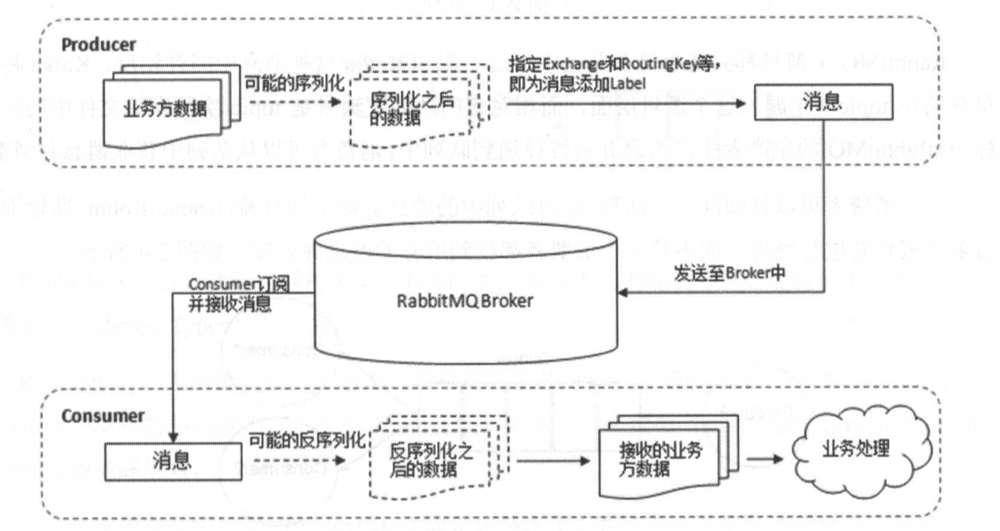

* [NestJs 使用 RabbitMQ](https://www.cnblogs.com/makalochen/p/17382858.html)

* docker run -id --name=rabbitmq -v /Users/zhoujin/Volumes/rabbitmq:/var/lib/rabbitmq -p 15672:15672 -p 5672:5672 -e RABBITMQ_DEFAULT_USER=admin -e RABBITMQ_DEFAULT_PASS=admin rabbitmq:management

# 前置知识
## RabbitMQ的exchange、bindingkey、routingkey的关系
 * 从 AMQP协议可以看出 Queue Exchange Binding构成了 AMQP协议的核心
 * Producer 消息生产者 即投递消息的程序
 * Broker 消息队列服务器实例
    *  Exchange 消息交换机 它指定消息按什么规则  路由到哪个队列
    *  Binding 绑定 它的作用就是 Exchange 和 Queue按照路由规则绑定起来。
    * Queue 消息队列载体 每个消息都会被投入到一个或多个队列
 * Consumer 消息消费者 即接受消息的程序。   

 * Binding 表示Exchange 与 之间的关系

# MQ的作用
1. 解耦 消息中间件在处理过程中插入了一个隐含的,基于数据的接口层,两边都实现这个接口,这样就允许独立的修改活着拓展两边的处理过程,只要两边遵守相同的接口约束即可。
2.  冗余(存储) 在某些情况下 处理数据的过程中会失败 消息中间件允许把数据持久化直到它们完全被处理。 扩展性 消息中间件 解耦了应用的过程 所以提供消息入队和处理的消息是很容易的，只需要增加处理流程就可以了。
3.  削峰 在访问量剧增的情况下 但是 应用仍然需要发挥作用 但是这样的突发流量并不常见。而使用消息中间件采用队列的形式可以减少突发访问压力, 不会因为突发的超时负荷要求而崩溃。
4. 可恢复性 当系统一部分组件失效时 不会影响到整个系统 消息中间件降低了进程间的耦合性,当一个处理消息的进程挂掉后，加入消息中间件的消息仍然可以在系统恢复后重新处理。
5. 顺序保证 
6. 缓冲
7. 异步通信

 

* [Node rabbitmq 入门就够了](https://blog.csdn.net/zhenghhgz/article/details/109300897)

 # 概念
 * RabbitMQ 整体上时一个 生产者与消费者模型,主要负责接收 存储和转发消息。
 * 可以把消息传递的过程想象成: 当你将一个包裹送到邮局,邮局会暂存并最终将邮件通过邮递员送到收件人的手上。RabbitMQ就好比 邮局 邮箱 邮递员组成系统。 RabbitMQ 交换机模型。

 * Broker 它提供一种传输服务 它的角色就是维护一条从生产者大消费者的路线,保证数据能按照指定的方式进行传输。
 * Exchange 消息交换机 它指定消息按什么机制规则 路由规则到哪个队列
 * Queue 消息的载体 每个消息都会被投到一个或多个队列。
 * Binding 绑定 它的作用就是把 exchange 和 queue按照路由规则绑定起来。
 * Routing key 路由关键字 exchange 根据这个关键字进行消息投递。
 * vhost 虚拟主机 一个broker 里可以有多个 vhost 用作不同用户的权限分离。
 * Producer 消息生产者 就是 投递消息的程序。
 * Consumer 消息消费者 就是接受消息的程序
 * Channel 消息通道 在客户端的每个链接里 可建立多个 channel。

 ## Broker 消息中间件的服务节点
 * 对于 RabbitMQ来说 一个 RabbitMQ Broker 可以简单地看作一个RabbitMQ服务节点,或者RabbitMQ服务实例。大多数情况下也可以将 一个 RabbitMQ Broker看作一台 RabbitMQ服务器。
 

 ## Exchange 交换机
 * 生产者将消息发送到 Exchange 由交换机将消息路由到一个或多个队列中。
 

 ## RoutingKey 与 Binding key

 * 生产者在将消息发送Exchange的时候 一般会指定一个 routing key 来指定这个消息的路由规则,生产者可以在发送消息给 Exchange时,通过指定 routing key 来决定消息流向哪里。

 * RabbitMQ 常用的 Exchange Type有三种 fanout direct topic

 1. fanout 把所有发送到该Exchange的消息投递到所有与 它绑定的队列中
 2. direct 把消息投递到那些 binding key 与 routing key 完全匹配的队列中
 3. topic 将消息路由到 binding key 与 routing key 模式匹配的队列中。